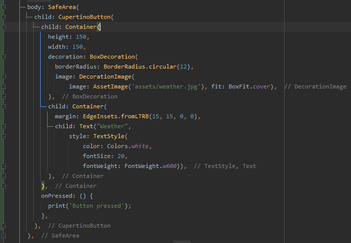
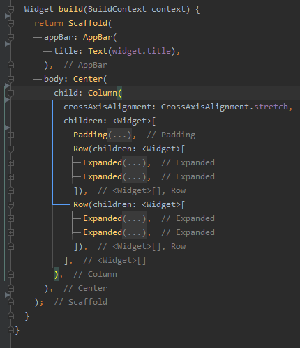
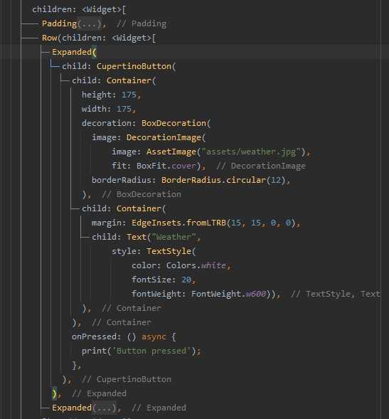

# flutter_cupertino_cards_design

A new Flutter application.

## Getting Started
**Output**  
  

**Single card using a container widget**  
  

**Column layout**    
  
  

- [Lab: Write your first Flutter app](https://flutter.dev/docs/get-started/codelab)
- [Cookbook: Useful Flutter samples](https://flutter.dev/docs/cookbook)
- [online documentation](https://flutter.dev/docs)
